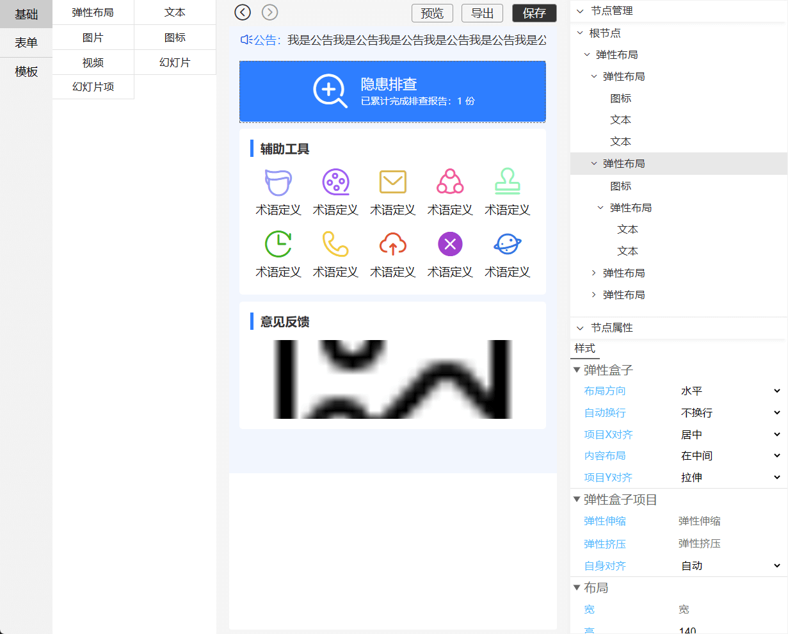

# Taro Design

一个简单易用，方便扩展和集成的移动端页面编辑器。
<center>
  
</center>

* [特点](#feature)
* [运行原理](#principle)
* [在线体验](#example)
* [快捷键支持](#hot-key)
* [在项目中使用](#use)
* [关于页面缩放相关配置](#otherproject)
* [交流群](#group)
* [合作](#cooperate)
* [重要更新日志](#update)
* [更多文档](#more)
	* [把自己的组件放在TaroDesign中运行](#custom-component)
	* [自定义图标库](#custom-icon)
	* [基础组件](#base-component)
	* [基础函数](#base-function)


## <a name='feature'></a>特点

- 发布到npm市场，可以很方便的将他集成到你的项目中。
- 你可以方便的编写一个组件在这个编辑器中运行，或者将你现有的组件经过简单修改运行在编辑器中。
- 编辑后的数据同时支持小程序、H5、React Native，需在Taro3的项目中使用。
- 组件样式遵循以React Native样式为基础的Flex布局，可以同时给设计师和开发人员使用。
- 导出为React组件后，可以继续进行二次开发。
- 模板市场给你提供了存储和使用模板的功能，你可以通过公开的模板快速创建页面，你也可以根据自己的需求创建模板。

## <a name='principle'></a>运行原理

你编辑的后的数据以json的方式运行和存储，下面的示例将一个text组件嵌套在一个view组件的json。
```json
[
  {
    "child": [
      {
        "style": {},
        "text": "文本内容",
        "nodeName": "text",
        "key": "2e0l1-19tg00",
        "child": []
      }
    ],
    "style": {},
    "nodeName": "view",
    "key": "2e0l1VzIiw00"
  }
]
```
对应的JSX代码如下，这些组件并不是原生的Taro组件，而是经过封装的，所以你看到下面的`Text`组件的文本并不是这样：`<Text>文本内容<Text>`，而是将文本内容赋值在其text属性上，其他组件的结构也大体如此。
```html
<View>
  <Text text='文本内容' />
</View>
```

## <a name='example'></a>在线体验

[点击前往在线地址](http://edit.t.platelet.xyz/)  
在线模板现在未开放注册账号以及管理功能，请使用下面的账号密码进行体验。  
- 用户名：admin  
- 密码：123456

## <a name='hot-key'></a>快捷键支持

ctrl + z 撤销操作  
ctrl + shift + z 恢复操作  
ctrl + c 复制节点  
ctrl + v 粘贴节点  
delete 删除节点

## <a name='use'></a>在项目中使用

```bash
yarn add taro-design
```

- 如果你的依赖库里没有下列组件，请添加

```bash
yarn add classnames
```

- 添加配置

```javascript
  // 小程序端
  mini: {
    webpackChain (chain) {
      // Taro 3.1 & 3.2
      chain.resolve.plugin('MultiPlatformPlugin')
        .tap(args => {
          return [...args, {
            include: ['taro-design']
          }]
        })

      // Taro 3.3+
      chain.resolve.plugin('MultiPlatformPlugin')
        .tap(args => {
          args[2]["include"] = ['taro-design']
          return args
        })
    }
  },
  // h5端
  h5: {
    esnextModules: [
      'taro-design'
    ],
    webpackChain (chain) {
      // Taro 3.1 & 3.2
      chain.resolve.plugin('MultiPlatformPlugin')
        .tap(args => {
          return [...args, {
            include: ['taro-design']
          }]
        })

      // Taro 3.3+
      chain.resolve.plugin('MultiPlatformPlugin')
        .tap(args => {
          args[2]["include"] = ['taro-design']
          return args
        })
    }
  },
  // rn端
  rn: {
    resolve: {
      include: ['taro-design']
    }
  }
```

项目配置文件位于`config/index.js`

- 编辑器使用示例

```jsx
import React from 'react'
import { Design } from 'taro-design/design'
import { TopView } from 'taro-design'


export default () => {
  return <TopView>
    <Design
      // 默认数据节点
      defaultNodes={[]}
      // 发生编辑时触发的事件 你可以返回一个Promise对象 将会显示一个正在保存的loading
      onChange={nodes => {}}
      // 点击保存按钮时触发的事件，当你配置了这个选项才会出现保存按钮 你可以返回一个Promise对象 将会显示一个正在保存的loading
      onSave={nodes => {}}
      // 开启模板 默认开启
      templateOpen
      // 开启导出 默认开启
      exportOpen
      // 应用在最外层的样式 你也可以通过.taro-design控制样式
      style={{ }}
      // 头部标题
      title='TaroDesign'
      // 用于自定义渲染标题，请传入jsx，当你定义这个参数时title将失效
      renderTitle={<View>自定义内容</View>}
    />
  </TopView>
}
  ```
  
注意 编辑器仅支持编译成h5使用，请勿在小程序或者app端调用，以及所有从 `taro-design/design` 导出的函数和组件都一样。

- 渲染模式使用示例

```jsx
import React from 'react'
import { TopView, Create } from 'taro-design'

export default () => {
  return <TopView>
    <Create nodes={[]} />
  </TopView>
}
```

- 使用提示  
不论是编辑模式还是渲染模式都请将 `TopView` 组件放在最外层，否则会导致样式错乱，弹窗无法使用

- 全局样式  
建议你在你的项目的全局样式文件中加入下面的样式，让小程序和h5端页面保持100%的高度
```css
/*  #ifndef rn h5  */
page {
  height: 100vh;
}
/*  #endif  */

/*  #ifdef h5  */
.taro_page {
  height: 100vh;
}
/*  #endif  */

```

## <a name='otherproject'></a>关于页面缩放相关配置

Taro H5端使用index.html中的js代码片段控制了rem单位的基础值的变换，如果你在后端代码中没有这个控制，你可以将`config/index.js`配置中的designWidth设置为375然后进行打包(这个值默认为750)。

```json
{
  "designWidth": 375
}
```  

相反如果你的是使用的Taro项目建议将这个值设置为1000左右，以获得较为合适的尺寸。  

```json
{
  "designWidth": 1000
}
```

此配置仅针对编辑器模式下，渲染模式请使用你的默认值  
你可能需要将Taro3升级到较新的版本，旧版本对这个配置支持不完整

## <a name='group'></a>交流群


## <a name='cooperate'></a>需要合作请加作者微信


## <a name='update'></a>重要更新日志

### v1.0.19

- 将 `taro-design/component` 修改为 `taro-design/components` ，如果你的项目使用了这个路径导入组件，请进行调整

- `PullView` 组件可以放在任何位置，不需要放在最外层
- 新增的 `Absolute` 组件可以将其中的内容添加到顶层，效果与Modal组件类似，只是其中的内容完全由你自定义

## <a name='more'></a>更多文档

### <a name='custom-component'></a>把自己的组件放在TaroDesign中运行 
你可以简单的开发一个组件，通过TaroDesign提供的注册函数，实现在其中运行，包括编辑器和运行时[（查看）](doc/customComponent.md)。


### <a name='custom-icon'></a>自定义图标库
系统内置的图标库包含了一些常见的图标 [点击查看图标](https://at.alicdn.com/t/project/2275070/db4d5200-5c79-42ad-a58c-579ddc701fc9.html?spm=a313x.7781069.1998910419.34)，如果你需要添加新的图标库请看这[（查看）](doc/icon.md)。

### <a name='base-component'></a>基础组件
这里面导出了一些常用组件。你可以将他们导入到你的项目中使用

```jsx
import { TopView, PullView, Modal, Absolute, Icon, Button, Loading, ScrollView, KeyboardAvoiding } from 'taro-design'
```

### <a name='base-function'></a>基础函数
项目引用了`taro-tools`这个依赖，这里面集成了多个常用函数，包含请求、日期、颜色、对象、字符串、表单验证、事件系统等，你可以直接导入到你的项目中使用。

```jsx
import { request, throttleRequest, setRequestConfig, dateToStr, dateDiff, colorToRgb, deepCopy, verify, event, ... } from 'taro-tools'
```
[TaroTools文档](https://github.com/ShaoGongBra/taro-tools)
